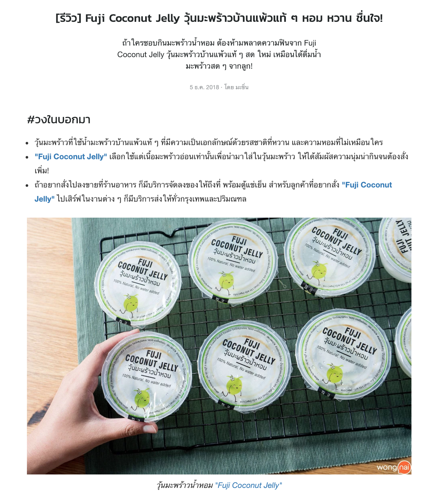

# 01 - HTML Semantics

## 1.1

Write HTML markup for the content displayed in the image below (Without CSS). 



## Texts

```
[รีวิว] Fuji Coconut Jelly วุ้นมะพร้าวบ้านแพ้วแท้ ๆ หอม หวาน ชื่นใจ! 

ถ้าใครชอบกินมะพร้าวน้ำหอม ต้องห้ามพลาดความฟินจาก Fuji Coconut Jelly วุ้นมะพร้าวบ้านแพ้วแท้ ๆ สด ใหม่ เหมือนได้ดื่มน้ำมะพร้าวสด ๆ จากลูก!

5 ธ.ค. 2018 · โดย มะขิ่น

#วงในบอกมา 

วุ้นมะพร้าวที่ใช้น้ำมะพร้าวบ้านแพ้วแท้ ๆ ที่มีความเป็นเอกลักษณ์ด้วยรสชาติที่หวาน และความหอมที่ไม่เหมือนใคร

"Fuji Coconut Jelly" เลือกใช้แต่เนื้อมะพร้าวอ่อนเท่านั้นเพื่อนำมาใส่ในวุ้นมะพร้าว ให้ได้สัมผัสความนุ่มน่ากินจนต้องสั่งเพิ่ม! 

ถ้าอยากสั่งไปลงขายที่ร้านอาหาร ก็มีบริการจัดลงของให้ถึงที่ พร้อมตู้แช่เย็น สำหรับลูกค้าที่อยากสั่ง "Fuji Coconut Jelly" ไปเสิร์ฟในงานต่าง ๆ ก็มีบริการส่งให้ทั่วกรุงเทพและปริมณฑล

https://img.wongnai.com/p/1920x0/2018/11/30/994fc4afe22d4ac09ef675ec8386a18b.jpg

วุ้นมะพร้าวน้ำหอม "Fuji Coconut Jelly"
```


## 1.2

Use CSS to change the apperance of the markup from the previous step content to match the image. 

Note
Discard the differences in font faces.


